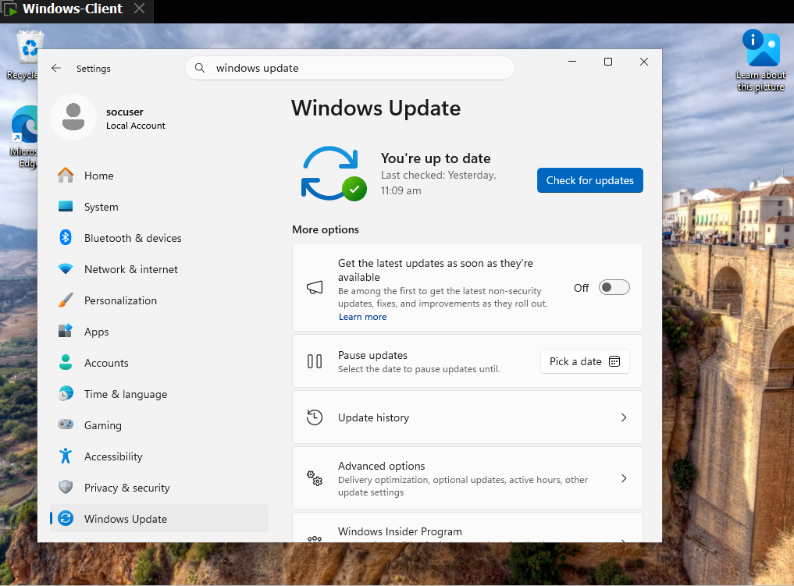
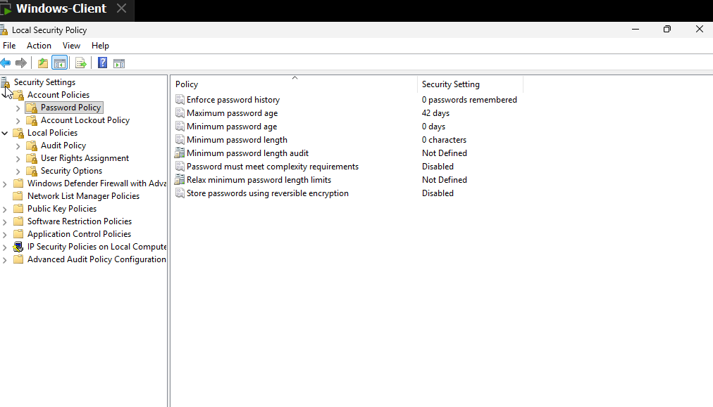

# Windows Security Assessment and Monitoring using Wazuh SIEM

## Overview
This project is a hands-on Security Operations Center (SOC) lab built to detect, monitor, and analyze security events on a Windows 11 endpoint using **Wazuh SIEM**. It was completed as a final project for the Bano Qabil SOC training program, simulating a real-world enterprise monitoring environment.

## Objective
To design and deploy a functional SIEM monitoring setup capable of:
- Detecting unauthorized account activity and login attempts
- Monitoring file system integrity for unauthorized changes
- Correlating and analyzing security events in real time via a centralized dashboard

## Lab Architecture
The lab was built using **VMware** with a 3-machine virtual environment:

| Machine | Role | OS |
|---|---|---|
| VM 1 | Monitored Endpoint | Windows 11 |
| VM 2 | Wazuh Manager / SIEM Server | Ubuntu |
| VM 3 | Network / Port Scanning | Kali Linux |

**Flow:** Windows 11 Endpoint (Wazuh Agent) → Wazuh Manager (Ubuntu) → Wazuh Dashboard → Alerts & Analysis

## Tools & Technologies
- **Wazuh SIEM** (Manager + Agent + Dashboard)
- **VMware Workstation** (virtualization)
- **Kali Linux**  (basic Nmap open-port check on Windows endpoint)
- **Windows Event Viewer** (log source)
- Wazuh **File Integrity Monitoring (FIM)** module
- `ossec.conf` custom configuration

## Setup Process
1. Deployed 3 virtual machines and configured networking between them
2. Installed Wazuh Manager and Dashboard on Ubuntu server
3. Installed and registered Wazuh Agent on the Windows 11 endpoint
4. Configured `ossec.conf` for custom log collection and FIM scope
5. Enabled File Integrity Monitoring on critical Windows directories
6. Generated controlled security events (account creation, login attempts, failed logins) to validate detection
7. Tested File Integrity Monitoring by creating/modifying/deleting files in monitored directories
8. Separately, ran a basic Nmap scan from the Kali Linux machine against the Windows endpoint to check for open ports

## Tests Performed & Windows Event IDs Monitored
| Event ID | Description |
|---|---|
| 4720 | User account created |
| 4726 | User account deleted |
| 4624 | Successful logon |
| 4625 | Failed logon attempt |

Additional testing included:
1. File creation/modification/deletion on monitored directories to validate FIM alerting.
2. A basic Nmap scan (from Kali Linux) against the Windows endpoint to check for open ports
3. Disabled and re-enabled the Windows Firewall on the endpoint to test detection coverage

## Findings & Results
- Successfully detected and alerted on all simulated account management events in real time via the Wazuh dashboard
- FIM correctly flagged unauthorized file changes within monitored directories
- Identified and documented a limitation: certain firewall-related events required additional local policy configuration to be captured — noted as a lesson learned for future SOC deployments

*(see Screenshots section)*

## Screenshots

### Windows Security Assessment

 
 
 
 
 
 
 
 
 
 

### Wazuh Monitoring & Alerts
 
 
 
 
 
 

## Skills Demonstrated
- SIEM deployment and configuration (Wazuh)
- Windows event log analysis
- File Integrity Monitoring
- Security lab design using virtualization (VMware)
- Security Event Detection and Basic Log Correlation

## Lessons Learned
- Understood how log source configuration directly affects detection coverage
- Learned to troubleshoot agent-manager connectivity issues
- Gained practical experience translating Windows Event IDs into actionable security alerts

  ## Full Project Report
📄 [View the complete project report (PDF)](Final%20Report.pdf)

## Author
**Momena Noor** — BS Information Technology | Aspiring SOC Analyst

https://www.linkedin.com/in/momena-noor-454767367
